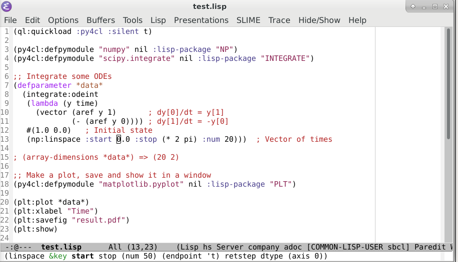
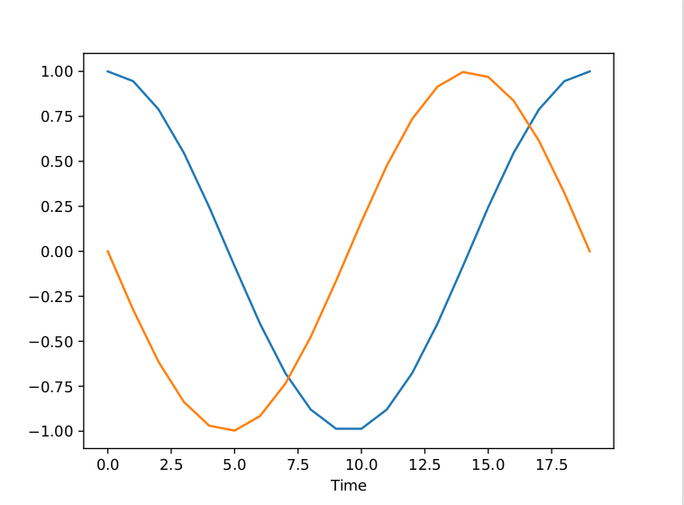

# Github Pages

Detailed documentation is available on [github-pages](https://digikar99.github.io/py4cl/).

# Quick Demonstration

</img>

```lisp
(ql:quickload :py4cl :silent t)

(py4cl:defpymodule "numpy" nil :lisp-package "NP")
(py4cl:defpymodule "scipy.integrate" nil :lisp-package "INTEGRATE")

;; Integrate some ODEs
(defparameter *data*
  (integrate:odeint 
   (lambda (y time) 
     (vector (aref y 1)       ; dy[0]/dt = y[1]
             (- (aref y 0)))) ; dy[1]/dt = -y[0]
   #(1.0 0.0)   ; Initial state
   (np:linspace :start 0.0 :stop (* 2 pi) :num 20)))  ; Vector of times

; (array-dimensions *data*) => (20 2)

;; Make a plot, save and show it in a window
(py4cl:defpymodule "matplotlib.pyplot" nil :lisp-package "PLT")

(plt:plot *data*)
(plt:xlabel "Time")
(plt:savefig "result.pdf")
(plt:show)
```

</img>

Great thanks to [Ben Dudson](https://github.com/bendudson) for starting this project, and documenting it enough to make it more-buildable!

